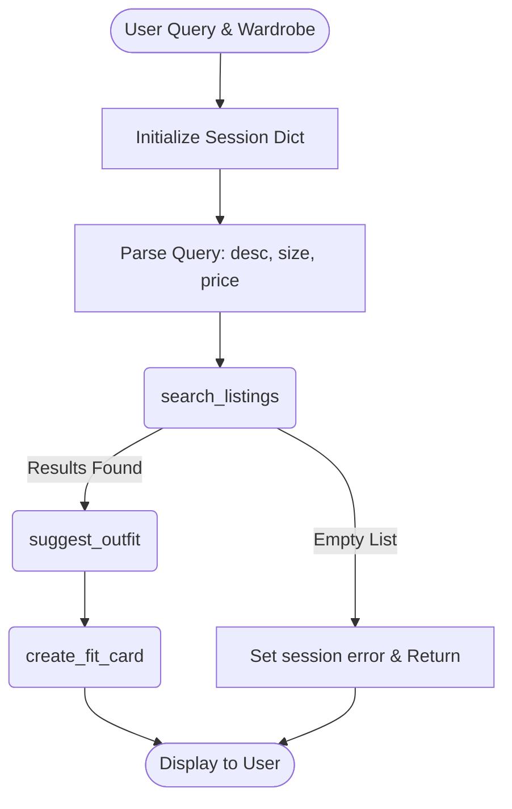

# FitFindr — planning.md

> Complete this document before writing any implementation code.
> Your spec and agent diagram are what you'll use to direct AI tools (Claude, Copilot, etc.) to generate your implementation — the more specific they are, the more useful the generated code will be.
> Your planning.md will be reviewed as part of your submission.
> Update it before starting any stretch features.

---

## Tools

List every tool your agent will use. For each tool, fill in all four fields.
You must have at least 3 tools. The three required tools are listed — add any additional tools below them.

### Tool 1: search_listings

**What it does:**
Searches the mock secondhand listings dataset for items that match the user's provided description, size, and maximum price, scoring them by relevance.

**Input parameters:**
- `description` (str): Keywords describing the desired item (e.g., "vintage graphic tee").
- `size` (str): Optional size string to filter by (e.g., "M" or "S/M").
- `max_price` (float): Optional maximum price ceiling to filter out expensive items.

**What it returns:**
A list of listing dictionaries that match the criteria, sorted by relevance score (highest first). Each dictionary includes fields like id, title, description, category, size, price, and platform.

**What happens if it fails or returns nothing:**
If no items match, the function returns an empty list. The agent should catch this, set an error message in the session, and return early without calling the subsequent tools.

---

### Tool 2: suggest_outfit

**What it does:**
Generates 1–2 complete outfit ideas by combining the newly found secondhand item with pieces from the user's existing wardrobe using an LLM.

**Input parameters:**
- `new_item` (dict): The selected listing dictionary from the search results.
- `wardrobe` (dict): The user's wardrobe dictionary containing a list of their owned items.

**What it returns:**
A descriptive string containing outfit suggestions formatted nicely for the user.

**What happens if it fails or returns nothing:**
If the user's wardrobe is empty, the LLM will generate general styling advice for the item instead of trying to combine it with nonexistent wardrobe pieces.

---

### Tool 3: create_fit_card

**What it does:**
Generates a short, engaging, and shareable caption (like for TikTok or Instagram) that captures the vibe of the outfit, mentioning the item, price, and platform.

**Input parameters:**
- `outfit` (str): The outfit suggestion string generated by Tool 2.
- `new_item` (dict): The listing dictionary for the selected secondhand item.

**What it returns:**
A 2–4 sentence caption string summarizing the outfit in a casual, authentic tone.

**What happens if it fails or returns nothing:**
If the outfit string is empty or missing, the tool handles it by returning a descriptive error string instead of crashing.

---

### Additional Tools (if any)

<!-- Copy the block above for any tools beyond the required three -->

---

## Planning Loop

**How does your agent decide which tool to call next?**
The agent follows a linear, sequential pipeline. It first parses the user's query into parameters (description, size, max_price). It calls `search_listings`. If results are found, it selects the top item and passes it to `suggest_outfit` along with the wardrobe. Finally, it passes the outfit suggestion and selected item to `create_fit_card`. It knows it's done when all three tools have executed successfully. If `search_listings` returns empty, the loop aborts early.

---

## State Management

**How does information from one tool get passed to the next?**
State is managed via a single `session` dictionary initialized at the start of the interaction. The agent stores the parsed query parameters in `session["parsed"]`, the top search result in `session["selected_item"]`, the output of Tool 2 in `session["outfit_suggestion"]`, and the output of Tool 3 in `session["fit_card"]`. This dict is passed sequentially to tools.

---

## Error Handling

For each tool, describe the specific failure mode you're handling and what the agent does in response.

| Tool | Failure mode | Agent response |
|------|-------------|----------------|
| search_listings | No results match the query | Set `session["error"]` to a helpful message and abort early. |
| suggest_outfit | Wardrobe is empty | Prompt LLM for general styling advice instead of specific combinations. |
| create_fit_card | Outfit input is missing or incomplete | Return a descriptive error message string instead of a caption. |

---

## Architecture

---

## AI Tool Plan

**Milestone 3 — Individual tool implementations:**
- I will provide the agent with the `tools.py` docstrings and the `planning.md` tool specs.
- For `search_listings`, I will ask the AI to implement the scoring logic based on keyword overlap with the description.
- For `suggest_outfit` and `create_fit_card`, I will ask the AI to write the Groq LLM prompts, making sure to handle the empty wardrobe edge case correctly.
- I will verify by running `tools.py` directly and writing small test scripts before integrating.

**Milestone 4 — Planning loop and state management:**
- I will provide the AI with the architecture diagram and the `agent.py` docstrings.
- I will ask it to write the `run_agent` sequential logic and query parsing logic (using regex or an LLM call).
- I will verify by running `agent.py` in the terminal to see if the "Happy path" and "No-results path" behave as expected.

---

## A Complete Interaction (Step by Step)

Write out what a full user interaction looks like from start to finish — tool call by tool call. Use a specific example query.

**Example user query:** "I'm looking for a vintage graphic tee under $30. I mostly wear baggy jeans and chunky sneakers. What's out there and how would I style it?"

**Step 1:**
- Tool called: `search_listings`
- Input: `description="vintage graphic tee"`, `max_price=30.0`
- Why this tool: To find the requested item in the dataset.
- Output: Returns a list of matching items. The top item (e.g., lst_006 "Graphic Tee") is selected.

**Step 2:**
- Tool called: `suggest_outfit`
- Input: `new_item=lst_006`, `wardrobe=example_wardrobe`
- Why this tool: To combine the found vintage tee with the user's baggy jeans and chunky sneakers.
- Output: "Style this faded tour tee with your baggy dark wash jeans and chunky white sneakers for the perfect effortless streetwear vibe."

**Step 3:**
- Tool called: `create_fit_card`
- Input: `outfit="..."`, `new_item=lst_006`
- Why this tool: To generate a shareable social media caption.
- Output: "Just scored the perfect 2003 vintage bootleg tee for only $24 on Depop. Pairing it with my baggy jeans and chunky kicks for ultimate comfort. 👟✨"

**Final output to user:**
The Gradio UI displays the top listing details, the outfit suggestion, and the fit card in the three respective panels.
